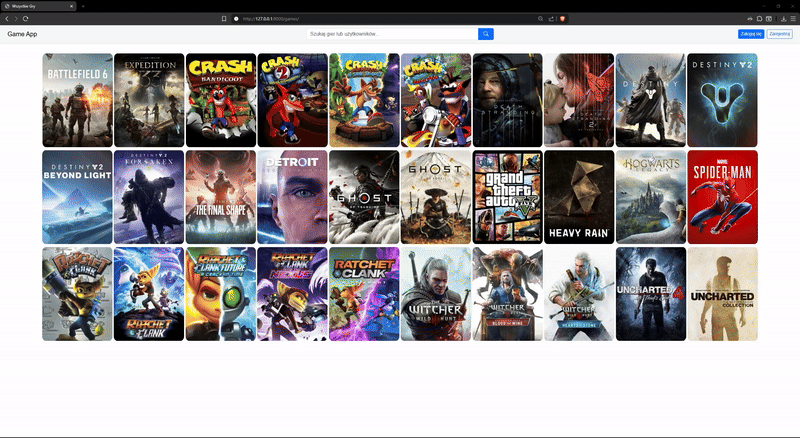

# Game Database App

A web application designed for gaming enthusiasts to track, rate, and share their gaming experiences.  
The system allows users to create accounts, manage their game library, and create custom lists.

---

### Demo

---
